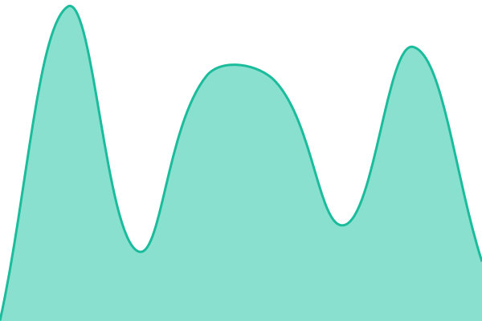
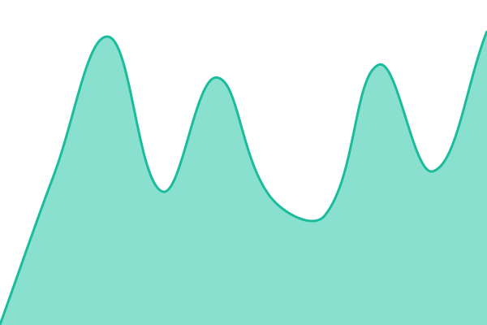
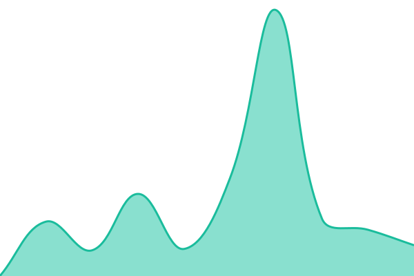
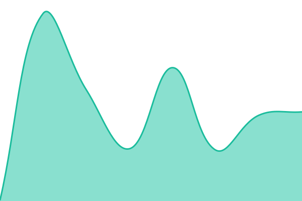

# [📈 Live Status](https://InetIntel.github.io/service-monitoring): <!--live status--> **🟩 All systems operational**

This repository contains the open-source uptime monitor and status page for [Internet Intelligence Lab](http://inetintel.org), powered by [Upptime](https://github.com/upptime/upptime).

With [Upptime](https://upptime.js.org), you can get your own unlimited and free uptime monitor and status page, powered entirely by a GitHub repository. We use [Issues](https://github.com/InetIntel/service-monitoring/issues) as incident reports, [Actions](https://github.com/InetIntel/service-monitoring/actions) as uptime monitors, and [Pages](https://InetIntel.github.io/service-monitoring) for the status page.

<!--start: status pages-->
<!-- This summary is generated by Upptime (https://github.com/upptime/upptime) -->
<!-- Do not edit this manually, your changes will be overwritten -->
<!-- prettier-ignore -->
| URL | Status | History | Response Time | Uptime |
| --- | ------ | ------- | ------------- | ------ |
|  [IODA website](https://ioda.inetintel.cc.gatech.edu) | 🟩 Up | [ioda-website.yml](https://github.com/InetIntel/service-monitoring/commits/HEAD/history/ioda-website.yml) | 

 264ms
     
 | 

<a href="https://InetIntel.github.io/service-monitoring/history/ioda-website">99.46%</a>
    

|  [GRIP website](https://grip.inetintel.cc.gatech.edu) | 🟩 Up | [grip-website.yml](https://github.com/InetIntel/service-monitoring/commits/HEAD/history/grip-website.yml) | 

 428ms
     
 | 

<a href="https://InetIntel.github.io/service-monitoring/history/grip-website">99.50%</a>
    

|  [IODA API](https://api.ioda.inetintel.cc.gatech.edu/v2/) | 🟩 Up | [ioda-api.yml](https://github.com/InetIntel/service-monitoring/commits/HEAD/history/ioda-api.yml) | 

 469ms
     
 | 

<a href="https://InetIntel.github.io/service-monitoring/history/ioda-api">99.55%</a>
    

|  [GRIP API](https://api.grip.inetintel.cc.gatech.edu/json/events?length=10&start=0&ts_start=2023-05-01T00%3A00&ts_end=2023-05-02T00%3A00&event_type=submoas&full) | 🟩 Up | [grip-api.yml](https://github.com/InetIntel/service-monitoring/commits/HEAD/history/grip-api.yml) | 

 939ms
     
 | 

<a href="https://InetIntel.github.io/service-monitoring/history/grip-api">99.60%</a>
    

|  [GRIP API blocklist](https://api.grip.inetintel.cc.gatech.edu/json/blocklist) | 🟩 Up | [grip-api-blocklist.yml](https://github.com/InetIntel/service-monitoring/commits/HEAD/history/grip-api-blocklist.yml) | 

 328ms
     
 | 

<a href="https://InetIntel.github.io/service-monitoring/history/grip-api-blocklist">99.65%</a>
    

|  [InetIntel lab website](https://inetintel.cc.gatech.edu/) | 🟩 Up | [inet-intel-lab-website.yml](https://github.com/InetIntel/service-monitoring/commits/HEAD/history/inet-intel-lab-website.yml) | 

 441ms
     
 | 

<a href="https://InetIntel.github.io/service-monitoring/history/inet-intel-lab-website">99.70%</a>
    

|  [IODA grafana](https://explore.ioda.inetintel.cc.gatech.edu) | 🟩 Up | [ioda-grafana.yml](https://github.com/InetIntel/service-monitoring/commits/HEAD/history/ioda-grafana.yml) | 

 517ms
     
 | 

<a href="https://InetIntel.github.io/service-monitoring/history/ioda-grafana">99.74%</a>
    

|  [GRIP grafana](https://explore.grip.inetintel.cc.gatech.edu) | 🟩 Up | [grip-grafana.yml](https://github.com/InetIntel/service-monitoring/commits/HEAD/history/grip-grafana.yml) | 

 469ms
     
 | 

<a href="https://InetIntel.github.io/service-monitoring/history/grip-grafana">99.79%</a>
    

|  [IODA reports](https://ioda.inetintel.cc.gatech.edu/reports/) | 🟩 Up | [ioda-reports.yml](https://github.com/InetIntel/service-monitoring/commits/HEAD/history/ioda-reports.yml) | 

 315ms
     
 | 

<a href="https://InetIntel.github.io/service-monitoring/history/ioda-reports">99.84%</a>
    

|  [InetIntel monitoring grafana](https://monitor.inetintel.cc.gatech.edu) | 🟩 Up | [inet-intel-monitoring-grafana.yml](https://github.com/InetIntel/service-monitoring/commits/HEAD/history/inet-intel-monitoring-grafana.yml) | 

 507ms
     
 | 

<a href="https://InetIntel.github.io/service-monitoring/history/inet-intel-monitoring-grafana">99.89%</a>
    

|  [BGPFinder API](https://bgpfinder.inetintel.cc.gatech.edu/meta/collectors) | 🟩 Up | [bgp-finder-api.yml](https://github.com/InetIntel/service-monitoring/commits/HEAD/history/bgp-finder-api.yml) | 

 324ms
     
 | 

<a href="https://InetIntel.github.io/service-monitoring/history/bgp-finder-api">99.94%</a>
    

|  [Aggie](https://ioda.inetintel.cc.gatech.edu/aggie/) | 🟩 Up | [aggie.yml](https://github.com/InetIntel/service-monitoring/commits/HEAD/history/aggie.yml) | 

 180ms
     
 | 

<a href="https://InetIntel.github.io/service-monitoring/history/aggie">99.98%</a>
    

<!--end: status pages-->

[**Visit our status website →**](https://InetIntel.github.io/service-monitoring)

## 📄 License

- Powered by: [Upptime](https://github.com/upptime/upptime)
- Code: [MIT](./LICENSE) © [Internet Intelligence Lab](http://inetintel.org)
- Data in the `./history` directory: [Open Database License](https://opendatacommons.org/licenses/odbl/1-0/)
